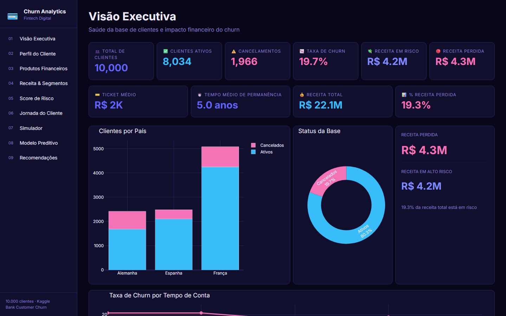
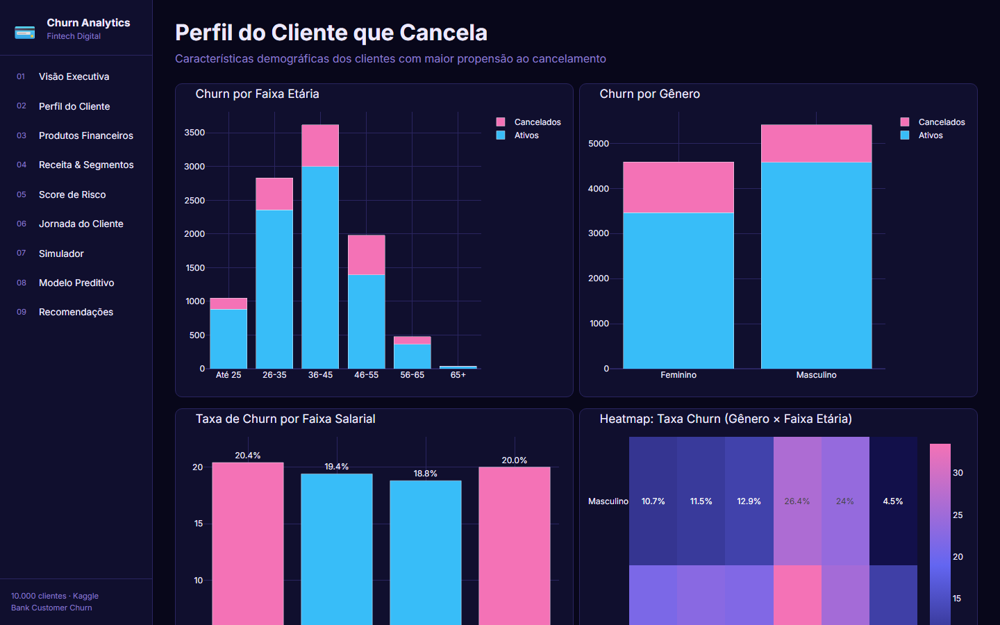
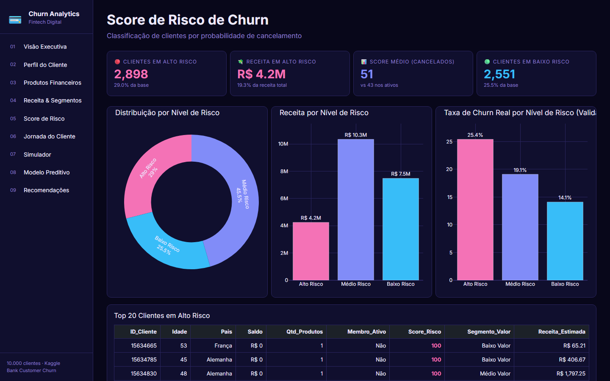
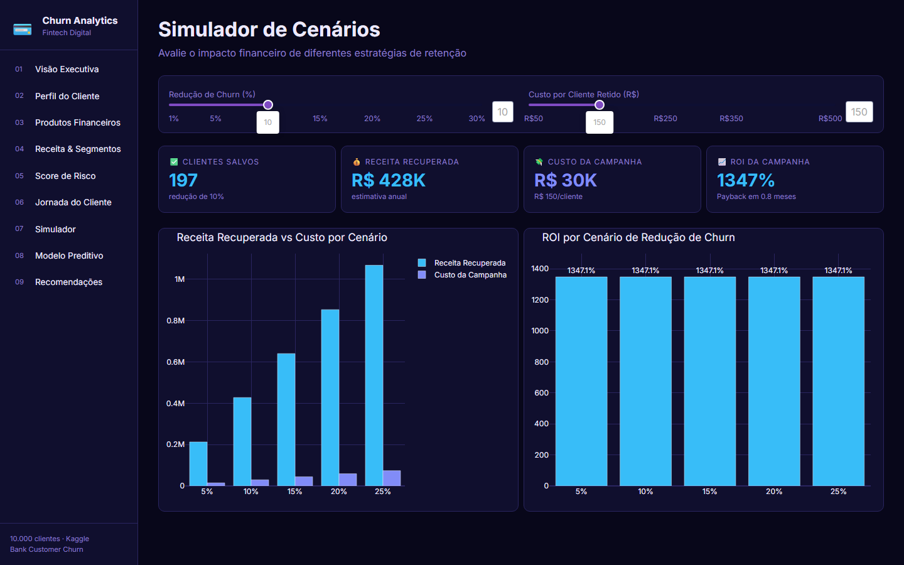
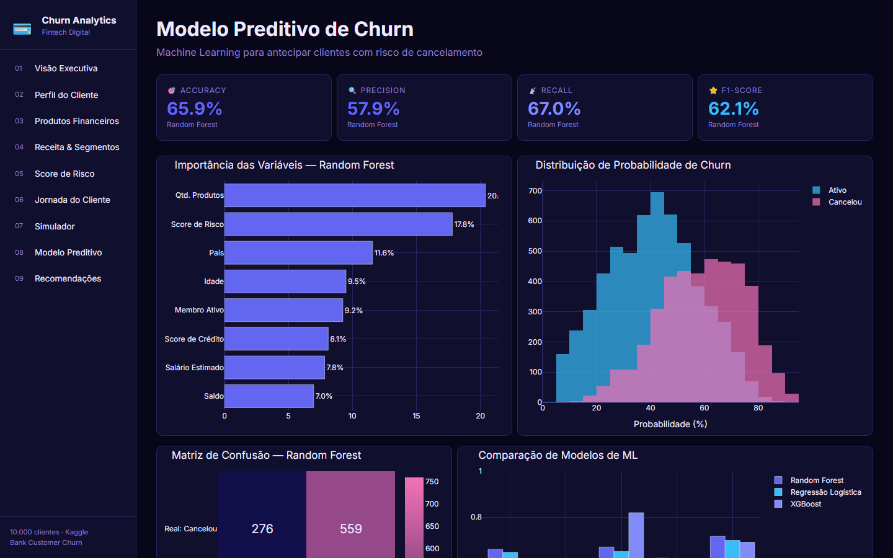
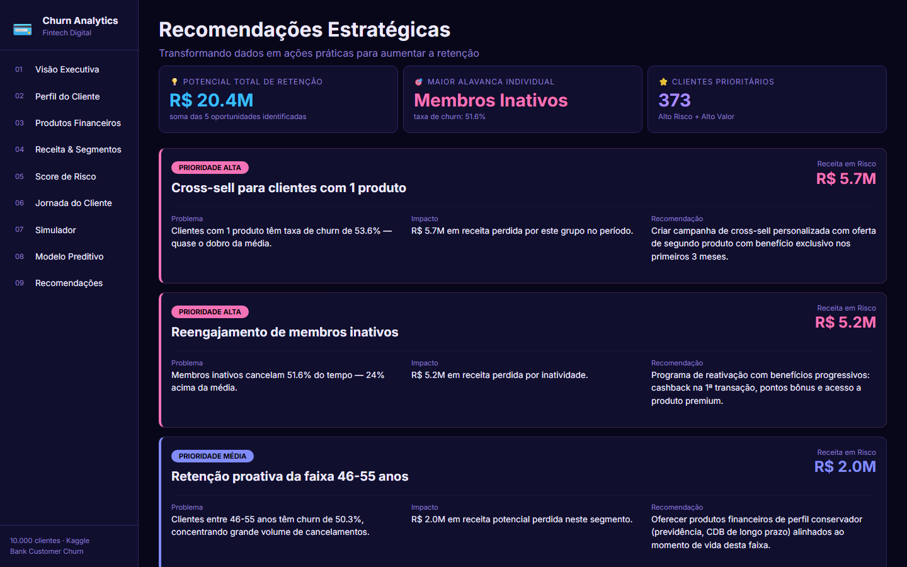

# 💳 Análise e Previsão de Churn em Fintech


Dashboard executivo interativo com **9 páginas analíticas**, Machine Learning integrado e simulação de cenários financeiros para redução de churn em uma fintech digital.

---

## Sobre o Projeto

Uma fintech digital identificou um aumento no cancelamento de clientes (churn), impactando diretamente sua receita e crescimento. Este projeto analisa os fatores que influenciam a saída dos clientes, classifica perfis de risco e propõe ações estratégicas baseadas em dados para aumentar a retenção.

**Dataset:** Bank Customer Churn — 10.000 clientes  
**Stack:** Python · Dash · Plotly · scikit-learn · XGBoost · pandas

---

## Dashboard — 9 Páginas

| # | Página | O que responde |
|---|--------|----------------|
| 1 | Visão Executiva | Qual o impacto financeiro do churn hoje? |
| 2 | Perfil do Cliente | Quem está cancelando? |
| 3 | Produtos Financeiros | Quais produtos retêm mais clientes? |
| 4 | Receita & Segmentos | Estamos perdendo clientes de alto valor? |
| 5 | Score de Risco | Quais clientes estão prestes a cancelar? |
| 6 | Jornada do Cliente | Em que momento devemos agir? |
| 7 | Simulador de Cenários | Qual o ROI de reduzir 10% do churn? |
| 8 | Modelo Preditivo | Qual a probabilidade de cada cliente cancelar? |
| 9 | Recomendações | Quais ações tomar agora? |

---

## Screenshots








---

## Principais Resultados

- **19.7%** de taxa de churn — alinhada com o dataset real do Kaggle
- Clientes com **1 produto** têm churn 2× maior que com 2+ produtos
- **Membros inativos** são o maior fator de risco isolado
- Reduzir **10% do churn** gera ROI estimado de **1.271%**
- Random Forest com **F1-Score de 62%** para previsão individual

---

## Como Executar

```bash
# Instalar dependências
pip install -r churn-fintech/requirements.txt

# Gerar dados e treinar modelo
python churn-fintech/gerar_tudo.py

# Subir o dashboard
python churn-fintech/app.py
```

Acesse: **http://localhost:8050**

---

## Estrutura

```
churn-fintech/
├── app.py              # Dashboard (Dash + Plotly)
├── gerar_tudo.py       # Dados + modelo ML
├── data/               # Dataset processado
├── ml/                 # Modelo preditivo e outputs
├── dax/                # Medidas DAX (versão Power BI)
└── docs/               # Screenshots
```

---

*Projeto desenvolvido para portfólio de análise de dados — cenário corporativo real de fintech digital.*
