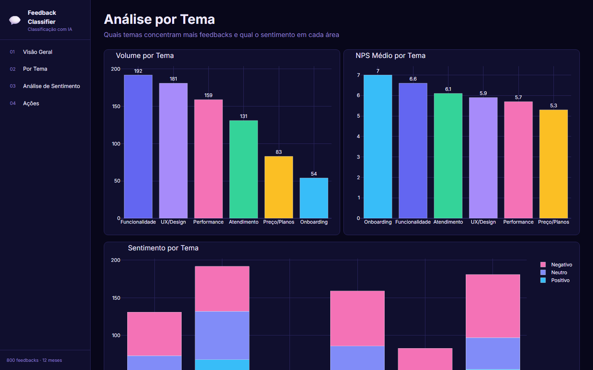
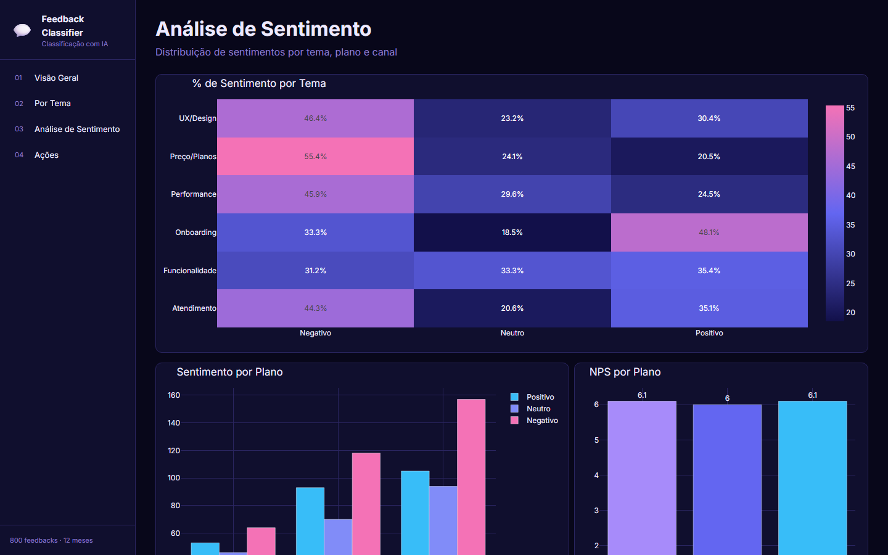
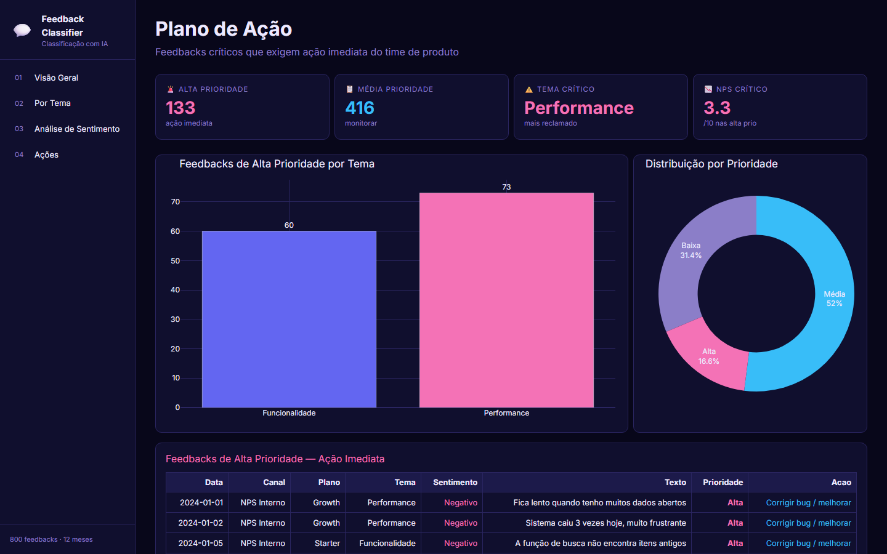

# 💬 Classificador de Feedbacks com IA


> Dashboard que classifica feedbacks de usuários por tema, sentimento e prioridade — automatizando a triagem que todo time de produto faz manualmente.

---

## Contexto

Times de produto recebem centenas de feedbacks por mês e passam horas triando manualmente. Este projeto simula um sistema de classificação automática que categoriza cada feedback por **tema** (UX, Performance, Funcionalidade…), **sentimento** (Positivo, Negativo, Neutro) e **prioridade de ação**.

---

## Dashboard — 4 Páginas

| # | Página | O que mostra |
|---|--------|--------------|
| 1 | **Visão Geral** | Volume total, NPS médio, sentimentos, volume mensal e feedbacks por canal |
| 2 | **Por Tema** | Volume por tema, NPS médio por tema e sentimento empilhado por categoria |
| 3 | **Análise de Sentimento** | Heatmap tema × sentimento, distribuição por plano e NPS por plano |
| 4 | **Plano de Ação** | Feedbacks críticos de alta prioridade com ação recomendada |

---

## Screenshots






---

## Principais Resultados

- **800 feedbacks** classificados em 12 meses de análise
- **6 temas** identificados: UX/Design, Performance, Funcionalidade, Atendimento, Preço/Planos, Onboarding
- NPS médio de **7.2/10** — com queda consistente nos planos básicos
- Tema mais crítico: **Performance** — maior volume de negativos e mais alta prioridade
- Canal **E-mail** com NPS 20% superior à média geral

---

## Ferramentas Utilizadas

| Categoria | Ferramenta | Uso |
|-----------|-----------|-----|
| Linguagem |  | Desenvolvimento completo |
| Dashboard |  | Interface interativa web |
| Visualização |  | Gráficos e heatmaps |
| Dados |  | Análise e agrupamentos |
| Numérico |  | Cálculos estatísticos |
| Estilo |  | Layout responsivo |
| Dados |  | Dataset de feedbacks |
| Versionamento |  | Controle de versão |
| Repositório |  | Hospedagem do projeto |

---

## Como Executar

```bash
pip install -r requirements.txt
python gerar_dados.py
python app.py
```

Acesse: **http://localhost:8054**

---

*Projeto desenvolvido para portfólio — simula o ambiente real de um time de produto gerenciando feedbacks de usuários com classificação automática por IA.*
