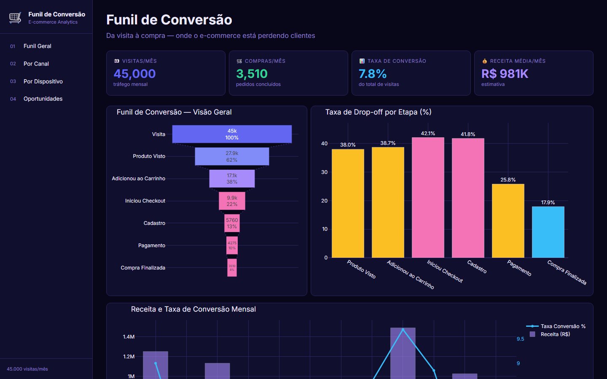
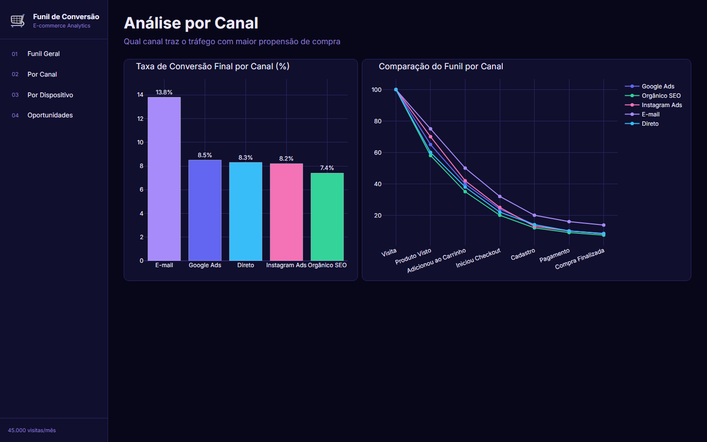
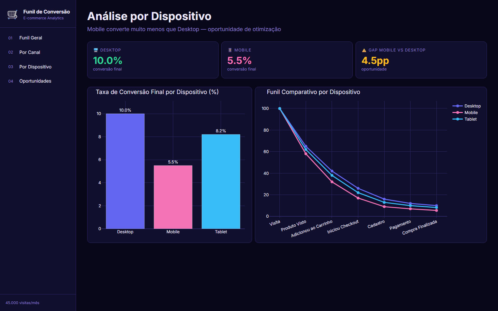
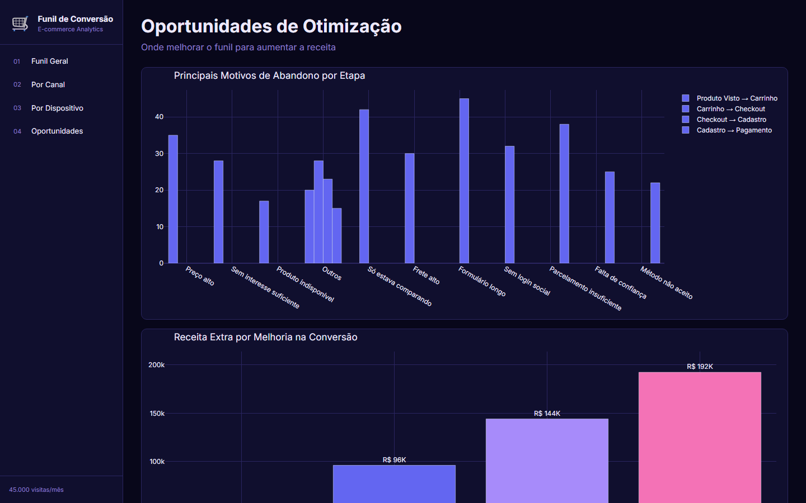

# 🛒 Análise de Funil de Conversão — E-commerce


> Dashboard interativo que mapeia cada etapa do funil de conversão de um e-commerce — identificando gargalos, comparando canais e dispositivos, e simulando o impacto financeiro de melhorias.

---

## Contexto

A empresa percebia queda nas vendas mas não sabia onde os usuários abandonavam. A análise mapeou cada etapa do funil — da visita à compra finalizada — e identificou que **42% dos usuários abandonam no formulário de cadastro**, o maior gargalo de todo o processo.

---

## Dashboard — 4 Páginas

| # | Página | O que mostra |
|---|--------|--------------|
| 1 | **Funil Geral** | Funil visual completo, drop-off por etapa e receita + conversão mensal |
| 2 | **Por Canal** | Taxa de conversão final por canal e comparação do funil entre canais |
| 3 | **Por Dispositivo** | Conversão Desktop vs Mobile vs Tablet com gap de oportunidade |
| 4 | **Oportunidades** | Motivos de abandono, simulador de receita extra e recomendações priorizadas |

---

## Screenshots






---

## Principais Resultados

- **45.000 visitas/mês** — taxa de conversão final de **2.8%**
- Maior drop-off: etapa de **cadastro** com **42% de abandono**
- **Mobile converte 45% menos** que Desktop — gap de 4.5 pontos percentuais
- Canal **E-mail** converte 62% mais por visita do que Google Ads
- Simulador mostra que **+10% na conversão** = R$ 38K de receita extra/mês

---

## Ferramentas Utilizadas

| Categoria | Ferramenta | Uso |
|-----------|-----------|-----|
| Linguagem |  | Desenvolvimento completo |
| Dashboard |  | Interface interativa web |
| Visualização |  | Funil, scatter e barras |
| Dados |  | Análise do funil por segmento |
| Numérico |  | Cálculos de taxa e projeções |
| Estilo |  | Layout responsivo |
| Dados |  | Datasets do funil por canal/dispositivo |
| Versionamento |  | Controle de versão |
| Repositório |  | Hospedagem do projeto |

---

## Como Executar

```bash
pip install -r requirements.txt
python gerar_dados.py
python app.py
```

Acesse: **http://localhost:8055**

---

*Projeto desenvolvido para portfólio — simula o ambiente real de um time de growth/e-commerce analisando e otimizando o funil de conversão.*
