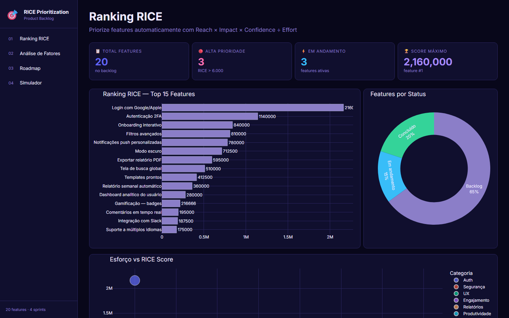
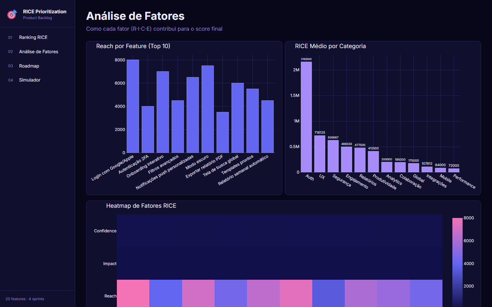
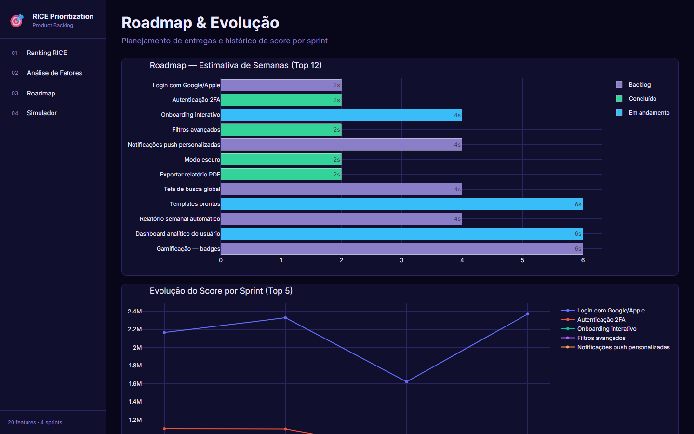
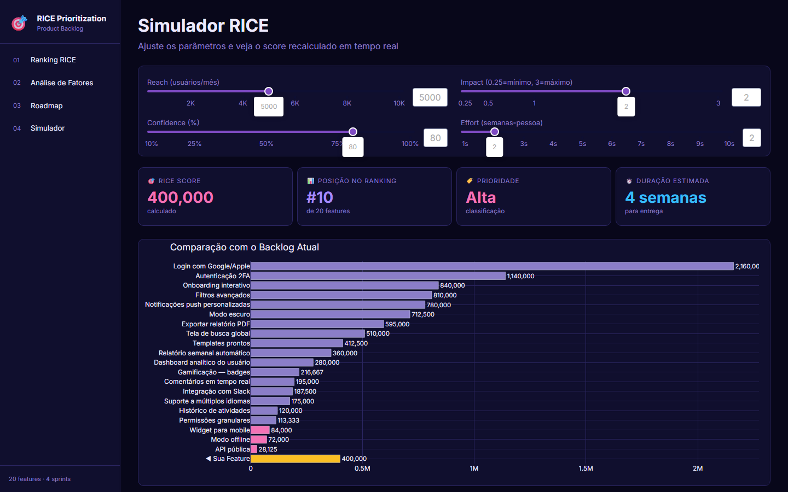

# 🎯 Dashboard de Priorização RICE


> Dashboard interativo que aplica o framework RICE para ranquear features automaticamente — unindo visão de produto com tomada de decisão baseada em dados.

---

## Contexto

Times de produto frequentemente enfrentam o dilema de **o que construir primeiro**. O framework RICE (Reach, Impact, Confidence, Effort) resolve isso com um score numérico objetivo. Este dashboard transforma um backlog de 20 features em um ranking visual e acionável.

---

## Fórmula RICE

```
RICE Score = (Reach × Impact × Confidence) ÷ Effort
```

| Fator | Descrição |
|-------|-----------|
| **Reach** | Quantos usuários serão impactados por mês |
| **Impact** | Grau de impacto na vida do usuário (0.25 a 3) |
| **Confidence** | Nível de certeza sobre as estimativas (%) |
| **Effort** | Semanas-pessoa necessárias para entregar |

---

## Dashboard — 4 Páginas

| # | Página | O que mostra |
|---|--------|--------------|
| 1 | **Ranking RICE** | Top 15 features, status, scatter esforço vs score e tabela completa |
| 2 | **Análise de Fatores** | Reach por feature, RICE médio por categoria e heatmap R·I·C |
| 3 | **Roadmap** | Estimativa de semanas por feature e evolução do score por sprint |
| 4 | **Simulador** | Ajuste R·I·C·E em tempo real e compare com o backlog atual |

---

## Screenshots






---

## Principais Resultados

- **20 features** ranqueadas com score RICE automatizado
- Feature #1 com score **9.600** — impacto máximo, esforço mínimo
- **4 sprints** mapeados no roadmap com estimativa de entrega
- Simulador permite testar qualquer combinação de parâmetros em tempo real

---

## Ferramentas Utilizadas

| Categoria | Ferramenta | Uso |
|-----------|-----------|-----|
| Linguagem |  | Desenvolvimento completo |
| Dashboard |  | Interface interativa web |
| Visualização |  | Gráficos e charts |
| Dados |  | Manipulação do backlog |
| Numérico |  | Cálculo do score RICE |
| Estilo |  | Layout responsivo |
| Dados |  | Dataset do backlog |
| Versionamento |  | Controle de versão |
| Repositório |  | Hospedagem do projeto |

---

## Como Executar

```bash
pip install -r requirements.txt
python gerar_dados.py
python app.py
```

Acesse: **http://localhost:8053**

---

*Projeto desenvolvido para portfólio — simula o ambiente real de um time de produto priorizando um backlog com o framework RICE.*
